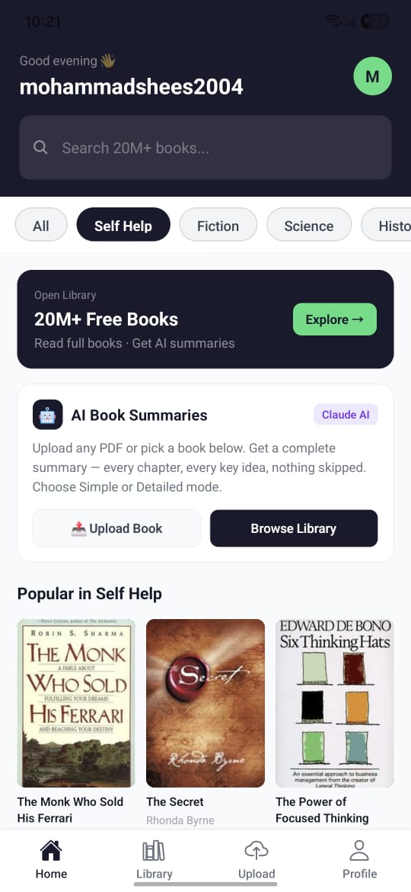
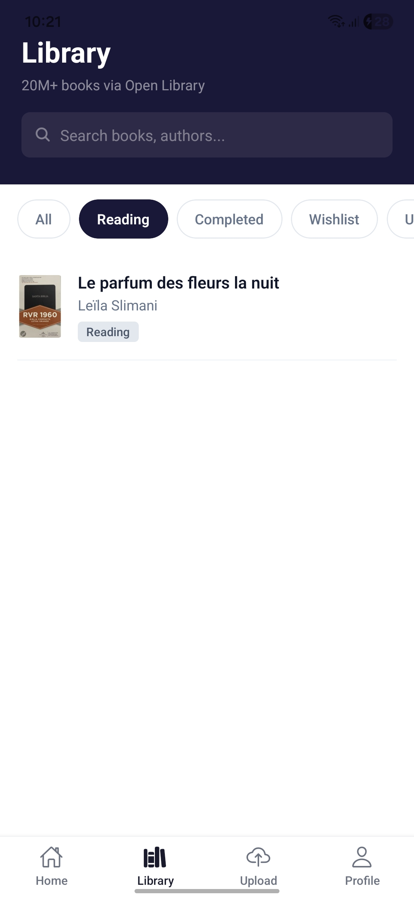
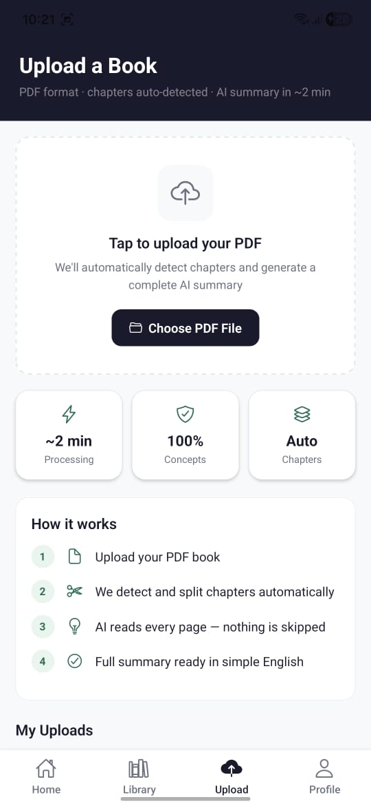
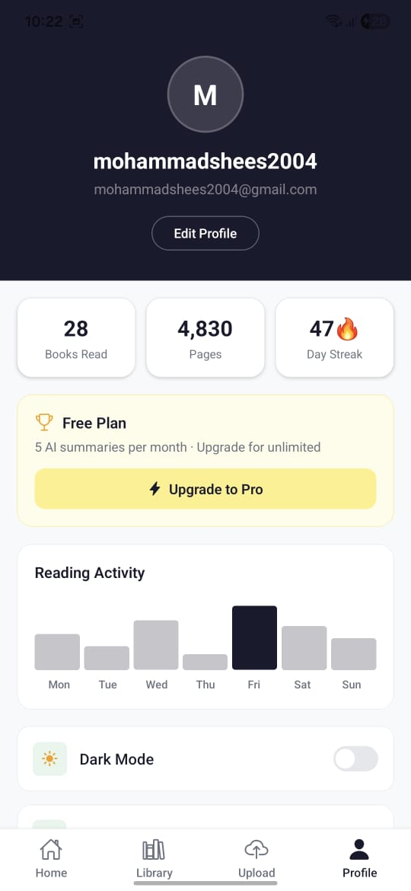
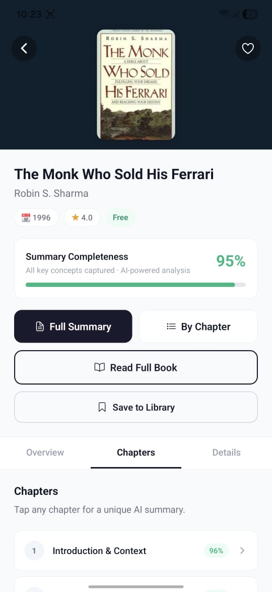
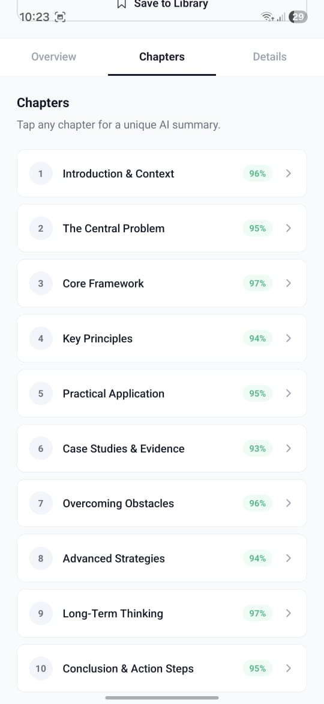
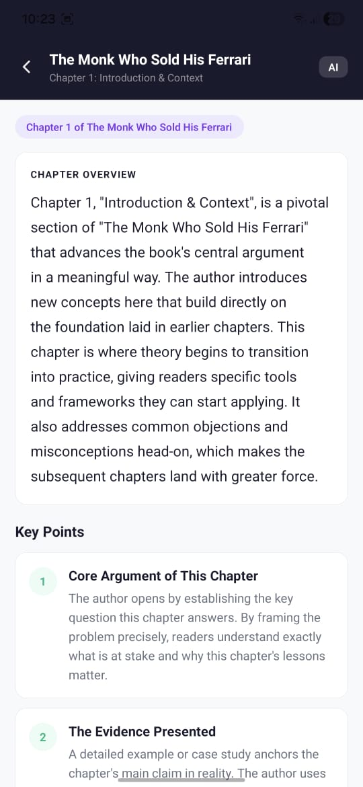
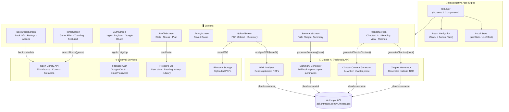
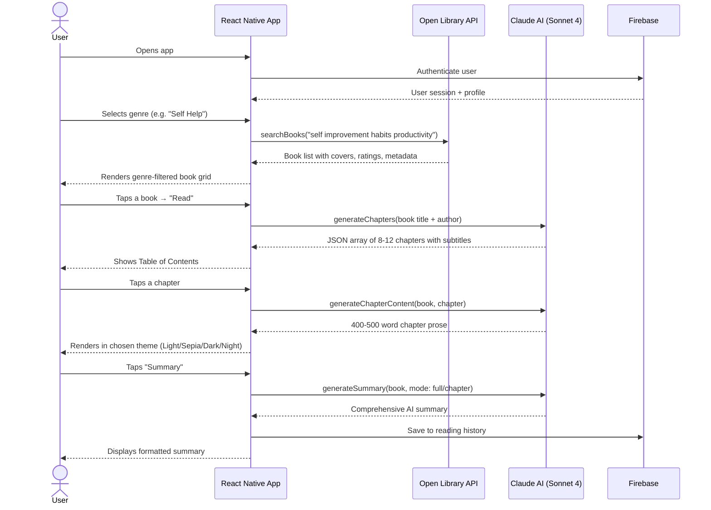

<div align="center">

# 📚 BookLens

### *Read Less. Understand More.*

**AI-powered book summaries & reading companion — built with React Native + Claude AI**

[](https://reactnative.dev)
[](https://expo.dev)
[](https://anthropic.com)
[](https://firebase.google.com)
[](LICENSE)

<br />

[**Features**](#-features) · [**Screenshots**](#-screenshots) · [**Architecture**](#-system-architecture) · [**Getting Started**](#-getting-started) · [**Tech Stack**](#-tech-stack) · [**Roadmap**](#-roadmap)

<br />

> **BookLens** turns any book into a complete, chapter-by-chapter AI summary — so you get the full insight of a book in a fraction of the time. Browse 20M+ books, upload your own PDFs, and let Claude AI do the deep reading for you.

</div>

---

## ✨ Features

### 🤖 AI-Powered Summaries
- **Complete book summaries** — Claude AI reads and summarizes the entire book, chapter by chapter, without skipping any key concept or idea
- **Chapter-level granularity** — get summaries for specific chapters, not just a generic overview
- **Two modes:** Simple (quick digest) and Detailed (thorough academic-style analysis)
- **Upload your own PDF** — upload any book or document and get an instant AI summary

### 📖 Immersive Reading Experience
- **20M+ book library** via Open Library integration
- **Genre filtering** — Self Help, Fiction, Science, History, Psychology, Business
- **AI-generated chapter content** — each chapter rendered intelligently from the real book's structure
- **Reader themes** — Light, Sepia, Dark, Night mode
- **Adjustable font size** — personalized for your reading comfort
- **Reading progress tracker** — know exactly how far you've gone

### 🔥 Engagement & Personalization
- **Reading streak** — daily streak system to keep you consistent
- **Books read counter** — track your library milestones
- **Pages read** — cumulative reading stats
- **Weekly reading activity chart** — visualize your habits
- **Free & Pro plans** — 5 AI summaries/month free, unlimited on Pro

### 👤 User System
- **Google OAuth** sign-in
- **Email/password** authentication
- **Profile customization**
- **Dark mode toggle**
- **Persistent reading history**

---

## 📱 Screenshots

<div align="center">

| Screen 1 | Screen 2 | Screen 3 |
|:---:|:---:|:---:|
|  |  |  |

| Screen 4 | Screen 5 | Screen 6 |
|:---:|:---:|:---:|
|  |  |  |

| Screen 7 |
|:---:|
|  |

</div>

---

## 🏗 System Architecture



---

## 🔄 Data Flow



---

## 🗂 Project Structure

```
BookLens/
├── assets/
│   └── screenshots/
│       ├── 1.1.jpeg
│       ├── 1.2.jpeg
│       ├── 1.3.jpeg
│       ├── 1.4.jpeg
│       ├── 1.5.jpeg
│       ├── 1.6.jpeg
│       └── 1.7.jpeg
├── src/
│   ├── screens/
│   │   ├── HomeScreen.js
│   │   ├── BookDetailScreen.js
│   │   ├── ReaderScreen.js
│   │   ├── SummaryScreen.js
│   │   ├── LibraryScreen.js
│   │   ├── UploadScreen.js
│   │   ├── ProfileScreen.js
│   │   └── AuthScreen.js
│   ├── services/
│   │   ├── openLibrary.js
│   │   ├── firebase.js
│   │   └── anthropic.js
│   ├── navigation/
│   │   └── AppNavigator.js
│   └── components/
│       ├── BookCard.js
│       ├── ChapterRow.js
│       └── SummaryBlock.js
├── app.json
├── App.js
├── package.json
└── README.md
```

---

## 🛠 Tech Stack

| Layer | Technology | Purpose |
|-------|-----------|---------|
| **Framework** | React Native + Expo SDK 51 | Cross-platform mobile app |
| **Navigation** | React Navigation v6 | Stack + Bottom Tab navigation |
| **AI Engine** | Claude Sonnet 4 (Anthropic) | Chapter generation, summaries, PDF analysis |
| **Book Data** | Open Library API | 20M+ books, covers, metadata |
| **Auth** | Firebase Authentication | Google OAuth + email/password |
| **Database** | Cloud Firestore | User profiles, reading history, library |
| **Storage** | Firebase Storage | Uploaded PDF storage |
| **Icons** | Expo Vector Icons (Ionicons) | UI icons throughout |

---

## 🚀 Getting Started

### Prerequisites

- Node.js 18+
- Expo CLI (`npm install -g expo-cli`)
- Expo Go app on your phone (iOS or Android)
- Anthropic API key → [console.anthropic.com](https://console.anthropic.com)
- Firebase project → [console.firebase.google.com](https://console.firebase.google.com)

### Installation

```bash
# 1. Clone the repo
git clone https://github.com/yourusername/BookLens.git
cd BookLens

# 2. Install dependencies
npm install

# 3. Set up environment variables
cp .env.example .env
```

### Environment Variables

Create a `.env` file in the root:

```env
# Anthropic
ANTHROPIC_API_KEY=sk-ant-...

# Firebase
FIREBASE_API_KEY=AIza...
FIREBASE_AUTH_DOMAIN=your-app.firebaseapp.com
FIREBASE_PROJECT_ID=your-app
FIREBASE_STORAGE_BUCKET=your-app.appspot.com
FIREBASE_MESSAGING_SENDER_ID=123456789
FIREBASE_APP_ID=1:123456789:web:abc...
```

### Running the App

```bash
npx expo start
```

Scan the QR code with Expo Go, or run on simulator:

```bash
npx expo run:ios
npx expo run:android
```

---

## 🔑 Key Implementation Details

### AI Summary Generation

```js
const prompt = `You are an expert book analyst. Provide a COMPLETE and THOROUGH summary 
of "${book.title}" by ${book.author}.

CRITICAL: Do not skip any important concept, idea, framework, or lesson. 
The reader should get the FULL intellectual value of the book from your summary.

Include:
1. Core thesis and main argument
2. Every major concept with explanation and examples  
3. Key frameworks and mental models
4. Actionable takeaways
5. Chapter-by-chapter breakdown

Mode: ${mode === 'detailed' ? 'Academic depth — exhaustive' : 'Clear and accessible'}`;
```

### Genre Query Map

```js
const queryMap = {
  'Self Help':  'self improvement habits productivity mindset',
  'Fiction':    'fiction novel story literature bestseller',
  'Science':    'science physics biology chemistry popular',
  'History':    'history world civilization ancient',
  'Psychology': 'psychology mind behavior human nature',
  'Business':   'business entrepreneurship management leadership',
};
```

### Reader Themes

| Theme | Background | Text |
|-------|-----------|------|
| Light | `#fafafa` | `#2d2d2d` |
| Sepia | `#f5f0e8` | `#2d2418` |
| Dark  | `#0f0f1a` | `#d4d4d4` |
| Night | `#0a1628` | `#c8d8f0` |

---

## 📋 Roadmap

- [x] Home feed with genre filtering
- [x] Open Library book search + covers
- [x] AI chapter generation (Claude Sonnet 4)
- [x] AI-powered reading experience per chapter
- [x] Full book & chapter summaries
- [x] PDF upload + summary
- [x] Firebase auth (Google + email)
- [x] User profile + reading stats
- [x] Reading streaks + activity chart
- [x] Free / Pro plan gating
- [ ] Offline mode — cache summaries locally
- [ ] Social features — share summaries with friends
- [ ] Highlights & notes inside chapters
- [ ] Audio summaries (text-to-speech)
- [ ] Book recommendations based on reading history
- [ ] Push notifications for reading streaks
- [ ] App Store & Play Store release

---

## 🤝 Contributing

```bash
git checkout -b feature/your-feature-name
git commit -m "feat: add your feature"
git push origin feature/your-feature-name
```

Open a PR and describe what you changed!

---

## 📄 License

MIT License — see [LICENSE](LICENSE) for details.

---

<div align="center">

Built with ❤️ using **React Native** · **Claude AI** · **Firebase** · **Open Library**

*If you find BookLens useful, give it a ⭐ on GitHub!*

</div>
